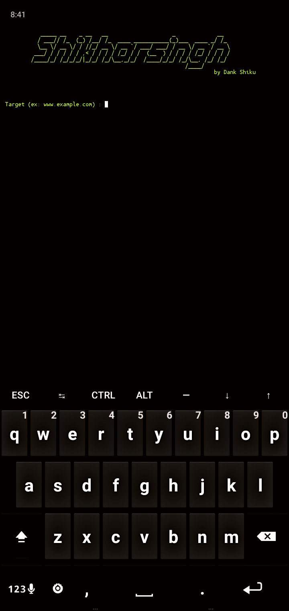

<p align="center">
  
</p>

##
<h3>Shikharsingh</h3>
Shikharsingh is basically an HTTP Denial of Service attack that affects threaded servers. It works like this:

We start making lots of HTTP requests.
1. We send headers periodically (every ~15 seconds) to keep the connections open.
2. We never close the connection unless the server does so. If the server closes a connection, we create a new one keep doing the same thing.
3. This exhausts the servers thread pool and the server can't reply to other people.

### Installation 
- Just, Clone this repository -
```
$ git clone https://github.com/Dankshiku/Shikharsingh
```

- Change to cloned directory and run `python shikharsingh.py` 
```
$ cd Shikharsingh
$ bash install.sh
$ python shikharsingh.py
```
### Screenshot

<p>
  
</p>

### Find Me on :
<p align="left">
  <a href="https://github.com/Dankshiku" target="_blank"></a>
  <a href="https://www.instagram.com/Dankshiku" target="_blank"></a>
  <a href="https://m.me/Dankshiku" target="_blank"></a>
</p>

